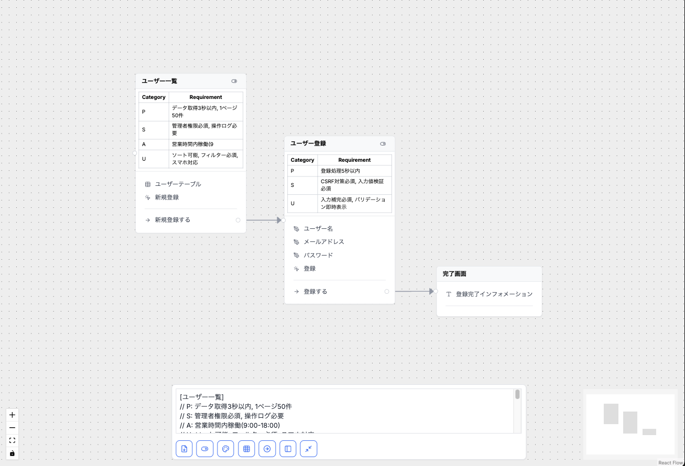

# User interface Flow Markup Language (UFML) Editor

UFMLエディターは、AI/LLM連携を前提とした軽量マークアップ言語UFMLから、インタラクティブな画面遷移図を生成するオープンソースのアプリケーションです。



## 🎯 UFMLとは

UFML (User interface Flow Markup Language) は、アプリケーションの画面遷移やUI要求、さらには関連する非機能要求を、一貫性のあるテキストベースで記述するために設計された軽量マークアップ言語です。

AI/LLMとの連携を前提に、UI開発プロセスを変革することを目指して設計されました。UI開発プロセスの中では中間言語としての役割を果たします。

### 主な目的

- **UI要件と非機能要件の統合管理**: 機能と非機能が一体となった要求管理を実現
- **チーム内コラボレーションの強化**: デザイナー、エンジニア、PdM、QA間の認識統一
- **AI/LLMによるDX・UX最大化**: テキストベース構造によるAI連携の最適化

## ✨ 主な機能

- **シンプルなマークアップ言語**: 直感的なUFML構文による画面遷移の定義
- **PSAU対応**: 非機能要件（パフォーマンス、セキュリティ、可用性、ユーザビリティ）の標準化された記述
- **リアルタイムプレビュー**: 入力と同時に視覚化を更新
- **AI/LLM最適化**: LLMが理解しやすい構造化テキスト形式
- **カスタム要素タイプ**:
  - `T`: テキスト要素（静的なテキスト、ラベル、見出し）
  - `E`: 編集可能フィールド（入力フィールド、チェックボックス等）
  - `B`: ボタン要素（クリック操作可能な要素）
  - `O`: その他のシステム要素（テーブル、リスト、画像等）
- **インタラクション定義**: 条件付き遷移とユースケース呼び出し
- **スマートな接続**: 自動的な接続経路とラベル付き遷移

## 🚀 はじめ方

### 必要条件

- Node.js 20.x 以降
- npm または yarn
- Git

### インストール

```bash
# リポジトリのクローン
git clone https://github.com/yourusername/ufml.git

# プロジェクトディレクトリへ移動
cd ufml/apps/ufml-editor-app

# 依存関係のインストール
npm install

# 開発サーバーの起動
npm run dev
```

## 📝 UFML構文

UFML は直感的な構文で画面遷移を定義します：

### ブロック定義

```
[画面名]                    # 画面ブロック
(ユースケース名)            # ユースケースブロック
```

### UI要素

```
T テキスト要素              # テキスト要素
E 編集フィールド            # 編集可能フィールド
B ボタン名                 # ボタン
O その他の要素              # その他のUIコンポーネント
```

### PSAUコメント（非機能要件）

```
//P: パフォーマンス要件      # パフォーマンス要件
//S: セキュリティ要件       # セキュリティ要件
//A: 可用性要件            # 可用性要件
//U: ユーザビリティ要件     # ユーザビリティ要件
```

### インタラクション

```
--                         # 区切り線
A インタラクション説明 => 遷移先           # 基本遷移
A インタラクション説明 ={条件}=> 遷移先    # 条件付き遷移
```

### 基本例

```
[ユーザー一覧]
//P: 一覧表示1秒以内
//S: 参照権限必須
//A: 99.9%稼働
//U: ソート機能必須

T ユーザーテーブル
O フィルター
B 新規追加
--
A ユーザー作成 => ユーザー作成画面

[ユーザー作成画面]
//P: レスポンス0.5秒以内
//S: 入力値検証必須

E ユーザー名
E メールアドレス
B 保存
B キャンセル
--
A 登録 => ユーザー一覧
A キャンセル => ユーザー一覧
```

### 条件付きアクション + ユースケース例

```
[管理ダッシュボード]
//P: 1秒以内
//S: role=admin

T 管理メニュー一覧
O フィルター
B 在庫管理
B 注文管理
--
A 在庫操作 ={在庫>=1}=> 在庫引き当て
A 受注処理 => 注文一覧

(在庫引き当て)
//P: 処理時間3秒以内
//S: トランザクション保証
```

## 🛠️ 技術スタック

- [Next.js](https://nextjs.org/) - Reactフレームワーク
- [React Flow](https://reactflow.dev/) - フロー視覚化
- [TailwindCSS](https://tailwindcss.com/) - スタイリング

## 💡 想定ユースケース

### 基本的な活用シーン

1. **画面設計の厳密な要件定義**
   - UI構成・遷移フローの文書化
   - 条件付き遷移の明示
   - PSAU等の非機能要件の記録と管理

2. **PRDレビュー時**
   - 画面構成の確認
   - 非機能要件の定義
   - 遷移パターンの検証

3. **デザインフェーズ**
   - UI要素の洗い出し
   - 画面遷移の可視化
   - 要件の具体化

4. **開発フェーズ**
   - 実装仕様の確認
   - テスト要件の抽出
   - ドキュメントの生成

### AI/LLM活用ユースケース

1. **要求仕様書やPRDからUFMLを自動生成**
   - 自然言語の要件からUFML形式への変換
   - 構造化された仕様書の自動作成

2. **UFMLから適合したUIコンポーネントの自動選定**
   - UI要素タイプに基づくコンポーネント推奨
   - デザインシステムとの自動マッピング

3. **UFMLからUIコードを自動生成**
   - React、Vue、Angular等のフレームワーク対応
   - 非機能要件を考慮したコード生成

4. **既存コードのUFML化による軽量保管**
   - 既存のReact、Vue、Angular等のフロントエンドコードからUFMLへの自動変換
   - 複雑なコードベースから画面構成、遷移ロジック、UI要素を抽出してUFML形式で軽量保管
   - レガシーシステムの画面仕様をUFMLとして再構築し、保守性を向上

5. **仕様レビューの自動化**
   - 矛盾検出、複雑度評価
   - UXアンチパターンの指摘

6. **UFMLエディターによる多ロールコラボレーション**
   - 共同編集による複数ステークホルダーの同時作業
   - 変更履歴管理

7. **テストケース・テストデータの自動生成**
   - インタラクションベースのテストシナリオ作成
   - 条件分岐を考慮したテストケース生成

## 🎯 UFMLのメリット

### 1. 開発チームとAI間の認識統一
UI構造、インタラクションロジック、非機能要求(PSAU)を単一のテキストファイルに集約し、デザイナー、エンジニア、PM、QA、そしてAI(LLM)にとっても共通言語として機能します。

### 2. 非機能要求(PSAU)の設計早期組み込みと管理
パフォーマンス、セキュリティ、可用性、ユーザビリティといった非機能要求を、機能仕様と同時に定義・管理できます。

### 3. AI/LLM連携による開発体験(DX)と品質(UX)の向上
LLMが理解しやすい構造化テキスト形式により、AIによる高精度な分析・生成支援を実現します。

### 4. 仕様変更への追従性と保守性の向上
仕様定義(UFML)と実装(コード)を分離し、UFMLの修正を起点としたLLMによるコード再生成や影響範囲分析を活用できます。

## ⚠️ 課題と考慮事項

### 1. 大規模プロジェクトでのスケーラビリティ
画面数や機能が多い場合のファイル分割、モジュール化の方法について事前の運用ルール整備が必要です。

### 2. 導入・学習コスト
チームメンバー全員の習熟と、構文チェッカー、エディタ支援、LLM連携ツールなどの支援ツール整備が望ましいです。

### 3. 記述の明確性と一貫性の維持
命名規則、記述スタイルの統一により、人間とLLM双方の理解精度を向上させる必要があります。

### 4. 自動化への過信の回避
LLMによる生成結果は必ず人間の専門家によるレビューと妥当性判断が不可欠です。

## 🤝 コントリビューション

コントリビューションを歓迎します！プルリクエストを自由に提出してください。大きな変更の場合は、まずissueを開いて変更内容について議論させていただけると幸いです。

1. プロジェクトをフォーク
2. フィーチャーブランチを作成 (`git checkout -b feature/新機能`)
3. 変更をコミット (`git commit -m '新機能を追加'`)
4. ブランチにプッシュ (`git push origin feature/新機能`)
5. プルリクエストを開く

## 📄 ライセンス

このプロジェクトは **デュアルライセンス構造** を採用しています：

## 🔓 UFML仕様 = MIT License（完全オープン）
- **対象**: UFML記法・構文・概念
- **ライセンス**: MIT License（商用利用も自由）
- **著作権**: Copyright (c) 2025 UFML Project
- **詳細**: [LICENSE](./LICENSE) ← **メインライセンス**
- **用途**: UFML仕様に基づく独自エディター・パーサー・ツールの開発

## 🔒 UFML Editor = カスタムライセンス（商用制限付き）
- **対象**: このエディターの実装コード・Webアプリ
- **ライセンス**: 商用利用制限付きカスタムライセンス
- **著作権**: Copyright (c) 2024 Kazuki Ikeda
- **詳細**: [LICENSE_EDITOR.md](./LICENSE_EDITOR.md)
- **制限**: 製品化・再販は要ライセンス（内部利用は可）

## 📋 利用シーン別ガイド

| やりたいこと | 参照するライセンス | 制限 |
|------------|------------------|------|
| **UFML仕様で独自ツール開発** | `LICENSE` | なし（MIT） |
| **エディターを企業内で利用** | `LICENSE_EDITOR.md` | なし |
| **エディターコードで商用製品開発** | `LICENSE_EDITOR.md` | 要商用ライセンス |

**重要**: UFML仕様（LICENSE）は完全オープン、エディター実装（LICENSE_EDITOR.md）は商用制限付き

## 📚 詳細ドキュメント

UFMLの設計思想や詳細な記述ルールについては、以下のドキュメントをご覧ください：

- [UFMLの設計思想と背景](./docs/CONCEPT.md)
